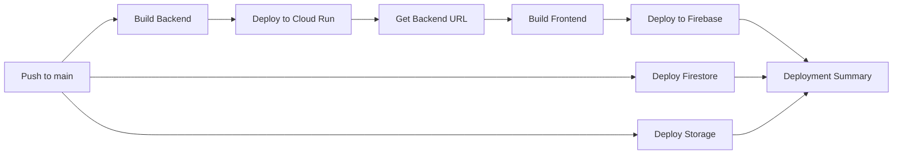

# CI/CD Setup Guide

Complete guide to setting up automated deployments with GitHub Actions.

## 🎯 Overview

This project uses GitHub Actions to automatically deploy:
- ✅ **Backend** → Google Cloud Run
- ✅ **Frontend** → Firebase Hosting
- ✅ **Database Rules** → Firestore
- ✅ **Storage Rules** → Firebase Storage

**Every push to `main` triggers a full deployment!**

## 🚀 Quick Setup (3 Steps)

### Step 1: Run Setup Script

```bash
./scripts/setup-github-actions.sh
```

This script will:
1. Create a Google Cloud service account
2. Grant necessary permissions
3. Set up GitHub secrets (if `gh` CLI is installed)
4. Enable required APIs

**Follow the prompts** and enter your GitHub repository when asked (format: `username/repo`).

### Step 2: Verify Secrets

Go to GitHub → Your Repo → Settings → Secrets and variables → Actions

Ensure these secrets exist:
- ✅ `GCP_PROJECT_ID` - Your Firebase/Google Cloud project ID
- ✅ `GCP_SA_KEY` - Service account key JSON
- ✅ `FIREBASE_SERVICE_ACCOUNT` - Firebase service account key JSON

### Step 3: Push to Main

```bash
git add .
git commit -m "Setup CI/CD"
git push origin main
```

Watch your deployment in **GitHub → Actions** tab! 🎉

## 📋 Manual Setup

If you prefer to set up manually or the script fails:

### 1. Create Service Account

```bash
# Set your project ID
PROJECT_ID="your-project-id"

# Create service account
gcloud iam service-accounts create github-actions \
  --display-name "GitHub Actions Deployer" \
  --project $PROJECT_ID
```

### 2. Grant Permissions

```bash
SA_EMAIL="github-actions@${PROJECT_ID}.iam.gserviceaccount.com"

# Grant necessary roles
gcloud projects add-iam-policy-binding $PROJECT_ID \
  --member="serviceAccount:${SA_EMAIL}" \
  --role="roles/run.admin"

gcloud projects add-iam-policy-binding $PROJECT_ID \
  --member="serviceAccount:${SA_EMAIL}" \
  --role="roles/iam.serviceAccountUser"

gcloud projects add-iam-policy-binding $PROJECT_ID \
  --member="serviceAccount:${SA_EMAIL}" \
  --role="roles/storage.admin"

gcloud projects add-iam-policy-binding $PROJECT_ID \
  --member="serviceAccount:${SA_EMAIL}" \
  --role="roles/secretmanager.secretAccessor"

gcloud projects add-iam-policy-binding $PROJECT_ID \
  --member="serviceAccount:${SA_EMAIL}" \
  --role="roles/cloudbuild.builds.editor"

gcloud projects add-iam-policy-binding $PROJECT_ID \
  --member="serviceAccount:${SA_EMAIL}" \
  --role="roles/artifactregistry.writer"
```

### 3. Create Key

```bash
gcloud iam service-accounts keys create github-actions-key.json \
  --iam-account=$SA_EMAIL \
  --project $PROJECT_ID
```

### 4. Add GitHub Secrets

Go to: `https://github.com/YOUR_USERNAME/YOUR_REPO/settings/secrets/actions`

Click **New repository secret** and add:

**1. GCP_PROJECT_ID**
```
your-project-id
```

**2. GCP_SA_KEY**
```json
{
  "type": "service_account",
  "project_id": "your-project-id",
  ...
  (entire contents of github-actions-key.json)
}
```

**3. FIREBASE_SERVICE_ACCOUNT**
```json
(same as GCP_SA_KEY)
```

### 5. Cleanup

```bash
# Delete the key file (it's now in GitHub Secrets)
rm github-actions-key.json
```

## 🔄 How It Works

### Workflow Triggers

The deployment workflow runs on:
- **Push to main** - Automatic deployment
- **Manual trigger** - Run workflow manually from GitHub UI

### Deployment Steps



### Job Details

**1. deploy-backend**
- Builds Docker image
- Pushes to Google Container Registry
- Deploys to Cloud Run
- Outputs backend URL

**2. deploy-frontend**
- Waits for backend URL
- Installs dependencies
- Builds with backend URL injected
- Deploys to Firebase Hosting

**3. deploy-firestore**
- Deploys Firestore rules and indexes

**4. deploy-storage**
- Deploys Storage security rules

**5. notify-deployment**
- Posts deployment summary

## 🎛️ Workflow Configuration

### Environment Variables

Set in [`.github/workflows/deploy.yml`](.github/workflows/deploy.yml):

```yaml
env:
  PROJECT_ID: ${{ secrets.GCP_PROJECT_ID }}
  REGION: northamerica-northeast1  # Change if needed
```

### Customization

#### Change Region

Edit `.github/workflows/deploy.yml`:

```yaml
env:
  REGION: northamerica-northeast1  # Change to your preferred region
```

#### Add Environment Variables

```yaml
- name: Deploy to Cloud Run
  run: |
    gcloud run deploy ishkul-backend \
      --set-env-vars "NEW_VAR=value" \
      # ... other flags
```

#### Deploy on Different Branches

```yaml
on:
  push:
    branches:
      - main
      - staging  # Add staging deployments
```

## 📊 Monitoring Deployments

### View in GitHub

1. Go to **Actions** tab
2. Click on latest workflow run
3. See logs for each job
4. Check deployment summary at bottom

### View Deployment Status

```bash
# Backend status
gcloud run services describe ishkul-backend --region northamerica-northeast1

# Frontend status
firebase hosting:channel:list

# View logs
gcloud run services logs read ishkul-backend --region northamerica-northeast1 --limit 50
```

### Deployment Notifications

The workflow creates a summary visible in:
- GitHub Actions UI (bottom of workflow run)
- Pull Request checks (if enabled)
- GitHub notifications

## 🐛 Troubleshooting

### Workflow Fails: "Permission denied"

**Solution:** Grant additional permissions to service account

```bash
gcloud projects add-iam-policy-binding $PROJECT_ID \
  --member="serviceAccount:github-actions@${PROJECT_ID}.iam.gserviceaccount.com" \
  --role="roles/MISSING_ROLE"
```

### Workflow Fails: "Secret not found"

**Solution:** Run setup script for Secret Manager

```bash
./scripts/setup-secrets.sh
```

### Workflow Fails: "API not enabled"

**Solution:** Enable required APIs

```bash
gcloud services enable \
  run.googleapis.com \
  cloudbuild.googleapis.com \
  secretmanager.googleapis.com \
  artifactregistry.googleapis.com
```

### Frontend Build Fails

**Solution:** Check frontend dependencies

```bash
cd frontend
npm install
npm run build  # Test locally
```

### Backend Image Build Fails

**Solution:** Test Docker build locally

```bash
cd backend
docker build -t test .
```

### Secrets Not Accessible

**Solution:** Grant secret accessor role

```bash
gcloud secrets add-iam-policy-binding firebase-service-account \
  --member="serviceAccount:github-actions@${PROJECT_ID}.iam.gserviceaccount.com" \
  --role="roles/secretmanager.secretAccessor"
```

## 🔐 Security Best Practices

### ✅ Do's

- ✅ Use GitHub Secrets for sensitive data
- ✅ Use service accounts with minimal permissions
- ✅ Rotate service account keys regularly
- ✅ Review permissions before granting
- ✅ Enable branch protection on `main`
- ✅ Require PR reviews before merging

### ❌ Don'ts

- ❌ Never commit service account keys
- ❌ Don't grant `roles/owner` to service accounts
- ❌ Don't share GitHub secrets
- ❌ Don't disable security checks

### Recommended Setup

1. **Branch Protection:**
   - Require pull request reviews
   - Require status checks to pass
   - Require branches to be up to date

2. **Environment Protection:**
   - Use GitHub Environments for production
   - Require manual approval for production deploys
   - Add environment-specific secrets

3. **Service Account Rotation:**
   ```bash
   # Every 90 days
   gcloud iam service-accounts keys create new-key.json \
     --iam-account=github-actions@${PROJECT_ID}.iam.gserviceaccount.com

   # Update GitHub secret
   gh secret set GCP_SA_KEY < new-key.json

   # Delete old key
   gcloud iam service-accounts keys delete OLD_KEY_ID \
     --iam-account=github-actions@${PROJECT_ID}.iam.gserviceaccount.com
   ```

## 🆚 GitHub Actions vs Manual Deployment

| Feature | GitHub Actions | deploy.sh |
|---------|---------------|-----------|
| **Trigger** | Git push | Manual command |
| **Location** | GitHub cloud runners | Your local machine |
| **Authentication** | GitHub Secrets | Local gcloud auth |
| **Consistency** | Same environment every time | Depends on your machine |
| **Speed** | Fast (parallel jobs) | Sequential |
| **Best For** | Production CI/CD | Local testing |
| **Cost** | Free for public repos | Free |

**Recommendation:**
- Use **GitHub Actions** for production deployments
- Use **`deploy.sh`** for local testing and development

## 📈 Advanced Configuration

### Separate Staging & Production

Create environment-specific workflows:

**.github/workflows/deploy-staging.yml**
```yaml
on:
  push:
    branches:
      - staging
env:
  PROJECT_ID: ${{ secrets.STAGING_PROJECT_ID }}
```

**.github/workflows/deploy-production.yml**
```yaml
on:
  push:
    branches:
      - main
env:
  PROJECT_ID: ${{ secrets.PRODUCTION_PROJECT_ID }}
```

### Add Testing Before Deploy

```yaml
jobs:
  test:
    runs-on: ubuntu-latest
    steps:
      - uses: actions/checkout@v4
      - name: Run tests
        run: |
          cd backend
          go test ./...

  deploy-backend:
    needs: test  # Only deploy if tests pass
    # ... rest of deployment
```

### Deploy Preview Channels

```yaml
- name: Deploy to Preview Channel
  uses: FirebaseExtended/action-hosting-deploy@v0
  with:
    repoToken: ${{ secrets.GITHUB_TOKEN }}
    firebaseServiceAccount: ${{ secrets.FIREBASE_SERVICE_ACCOUNT }}
    projectId: ${{ env.PROJECT_ID }}
    expires: 7d
```

## 📚 Resources

- [GitHub Actions Documentation](https://docs.github.com/en/actions)
- [Cloud Run CI/CD](https://cloud.google.com/run/docs/continuous-deployment)
- [Firebase Hosting GitHub Action](https://github.com/FirebaseExtended/action-hosting-deploy)
- [Workflow Syntax](https://docs.github.com/en/actions/reference/workflow-syntax-for-github-actions)

## 🆘 Getting Help

- Check [.github/workflows/README.md](.github/workflows/README.md)
- View [DEPLOY_GUIDE.md](DEPLOY_GUIDE.md) for deployment details
- Review [GitHub Actions logs](https://github.com/YOUR_REPO/actions)

---

**Ready to automate?** Run `./scripts/setup-github-actions.sh` to get started! 🚀
